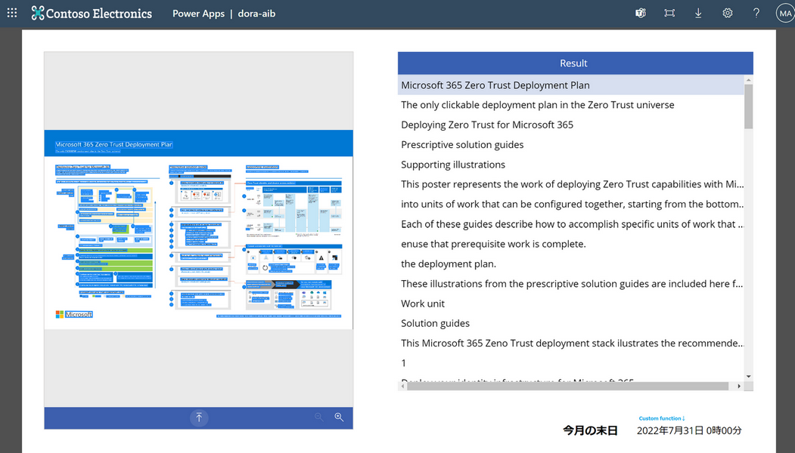
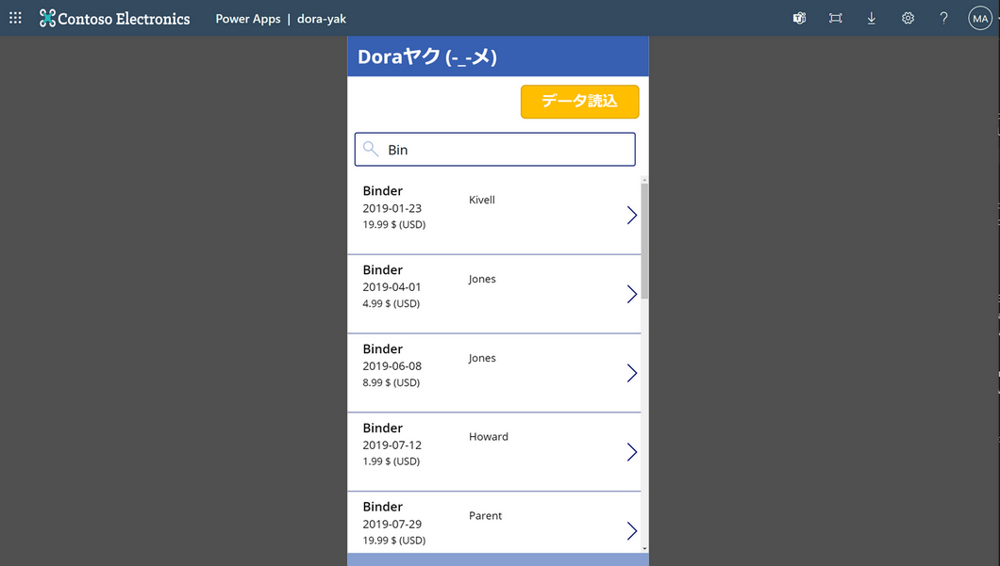
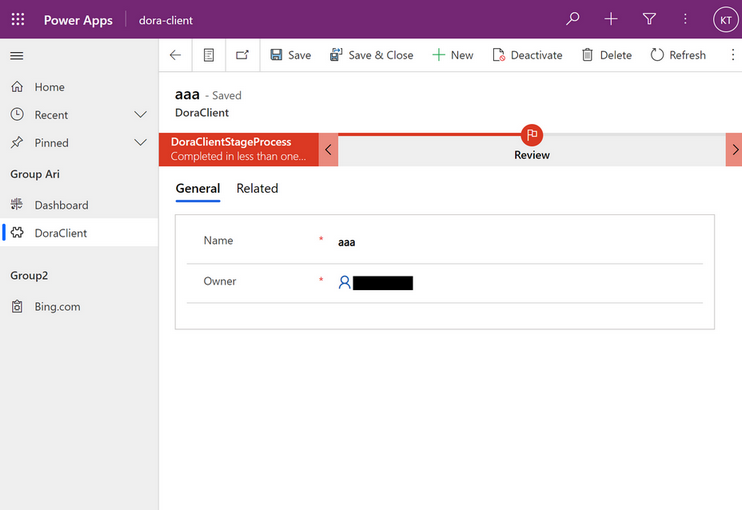
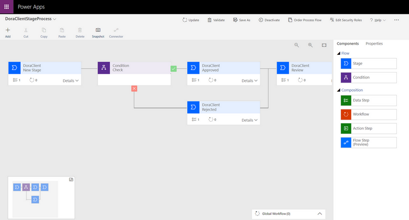
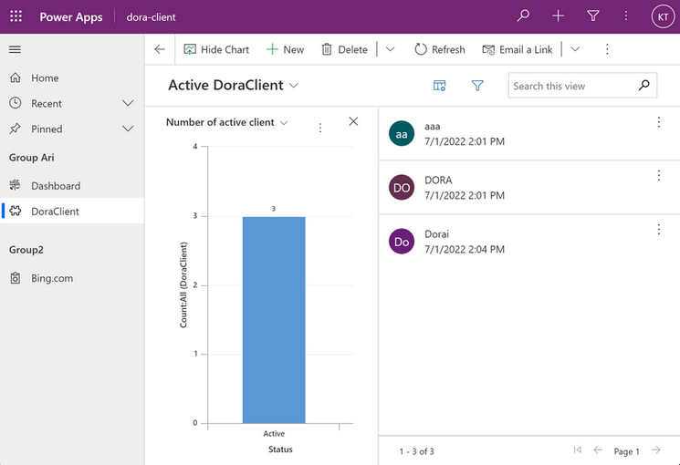
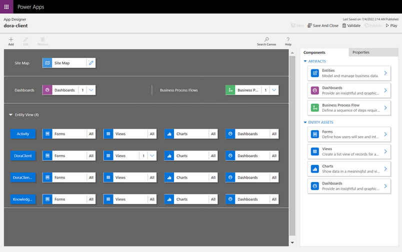
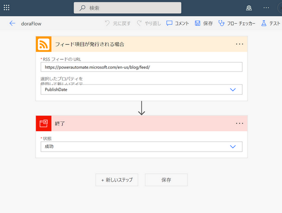
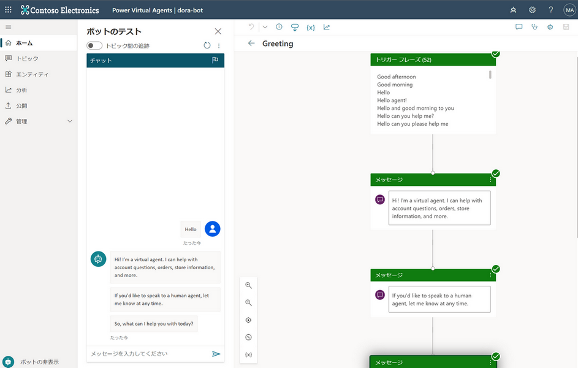

# Power Platform Playbook 

Power platform: According to a comment on Microsoft document, Quickly build data-driven business solutions with the Microsoft Power Platform—Power BI, Power Apps, Power Automate, and Power Virtual Agents.

 - Power Apps: Low code, No code - Canvas app, Model-driven apps integrated with Dataverse
 - Power Automate: Automated processes with flows, RPA 
 - Power Virtual Agents: Intelligent conversational bot platform
 - AI Builder: AI models provider to optimize your business processes
 - Power BI: Business intelligence (BI), reporting, and data visualization

The `dolution` is a composition of demo applications created by power platform. 

All applications and components are created for understanding basic features and items in power platform.

# The component of `dolution`

## Power apps - Canvas app

 - AI Builder - Text recognizer model based app 
 
 This app included the custom function named `EOMonth`. It is a preview feature and there is a mention of details in URL how to attach and create on your canvas. 

> More information: [Custom fuction resuable code](https://www.matthewdevaney.com/power-apps-custom-functions-reusable-code)

 

 - Basic App for searching and displaying an item

 This app is created for searching and displaying selected item details, the data source is composited by Collection data, which is going to be loaded by "Data Creation" button.

 

## Power apps - Model-driven app

 - Tables and Business flows

 Model-driven applications are derived from Dynamic 365 customization features. so that a few settings are able to configure and set a detail only on Dynamic 365 configuration screen. Especially entity based a record and attribute controls only are visible on Dynamic 365. 

 The model-driven app does not provide various UI controls and customization compared to the canvas app. It focuses on business flow and simple visualization.

 - Site maps and Dashboard, graph

 Actually, The model-driven provides an approach to extend its feature by defining data, relations, tables, and columns. On top of that, it has a feature to display a visualization.
 
 For example, Site map is for navigating a model. Dashboard can be embedded with a list of items and a graph of the specific model. 

## Power Automate - Cloud Flow

 - from RSS to Exit  

 This cloud flow does not have any functionality. it is just for adding to check which movement would be conducted during a solution export.

## Power Virtual Agents

 - Chatbot for understanding authring canvas and topic

 Chatbot has a feature to customize Topic and Entity, Dialogue flow to control UX. This item is for figuring out the basic features.

# Export solution to another environment

Export the unmanaged solution(s) from your development environment as managed. More information: [Export solutions](/powerapps/maker/data-platform/export-solutions) and [Power platform export solutions](https://github.com/MicrosoftDocs/power-platform/blob/main/power-platform/alm/move-from-unmanaged-managed-alm.md)

# Trouble shooting

- Issue: 
> After importing a solution, during opening a model-driven app, the error displays "this account is not Member Of Org".

- Solution: When you import a flow from one environment to another environment (not in same Org), the connection to a action in your flow would not be updated to the new instance automatically. You must update the connection to the action in your flow manually.

Currently, there is no way to update the connection of a action in a flow automatically from one Organization to another Organization.

- More information: [Link](https://powerusers.microsoft.com/t5/Building-Power-Apps/Organization-issue-after-importing-the-PowerApps-package-into/td-p/185159)
